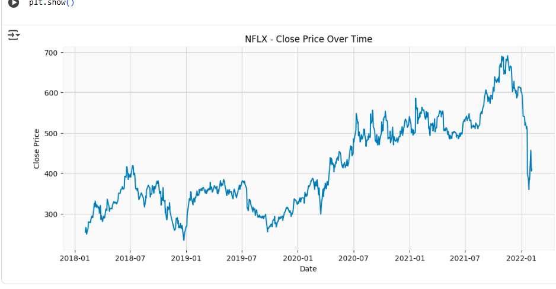
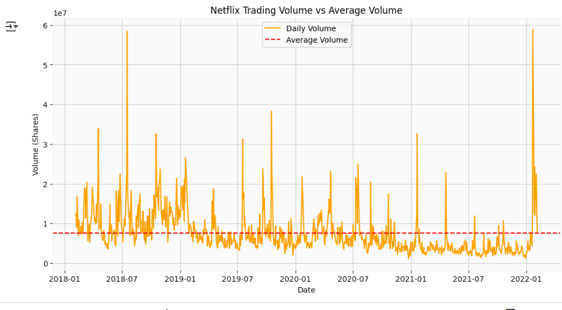
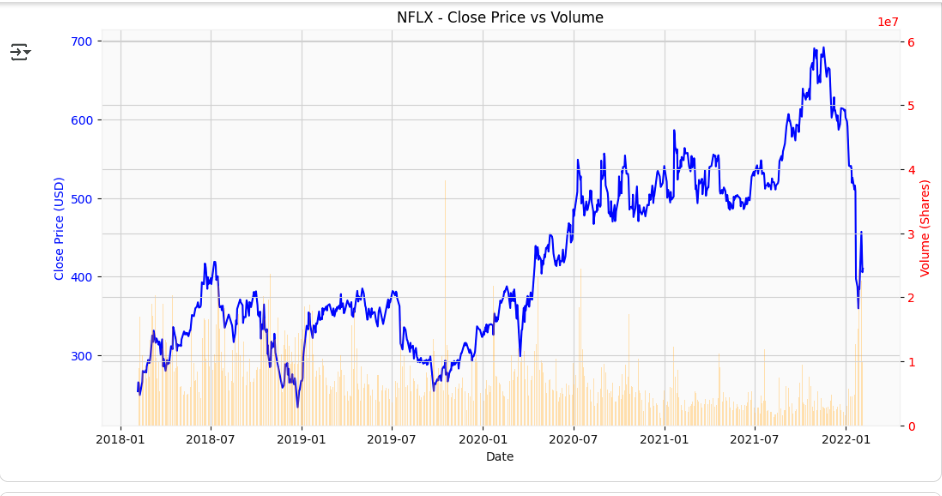
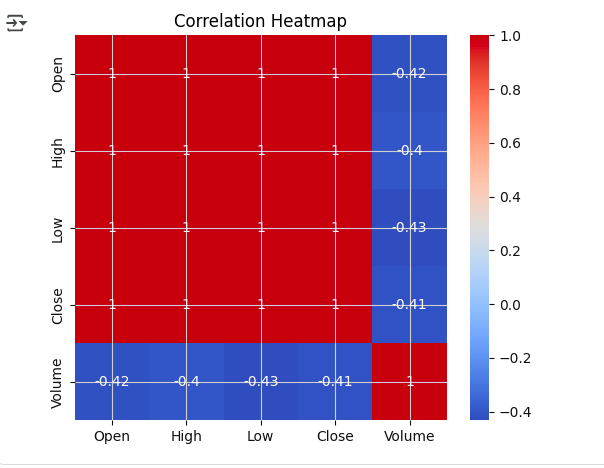
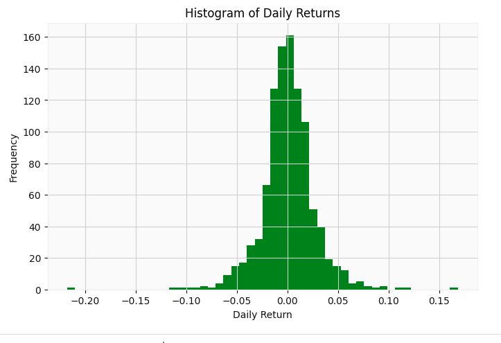
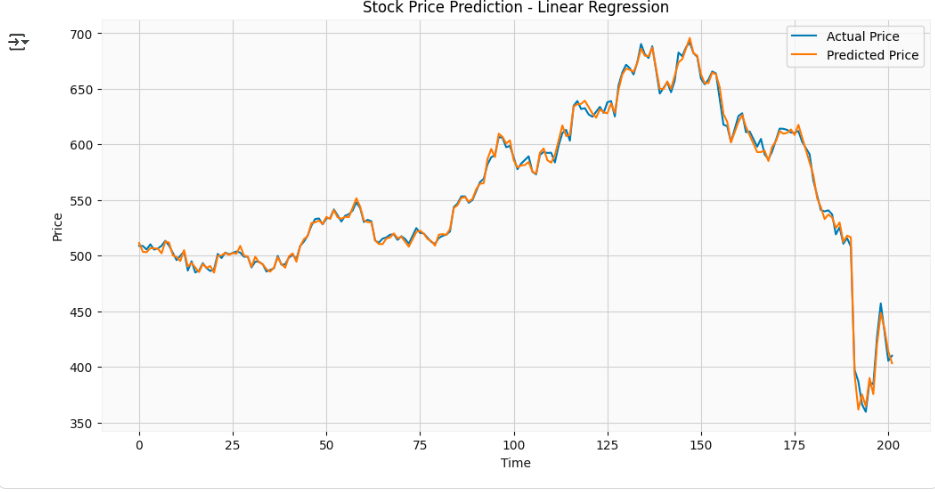
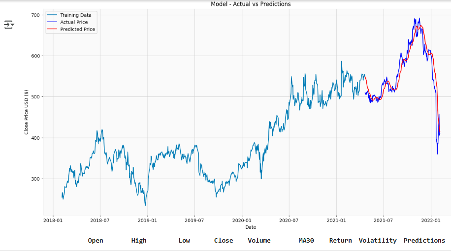
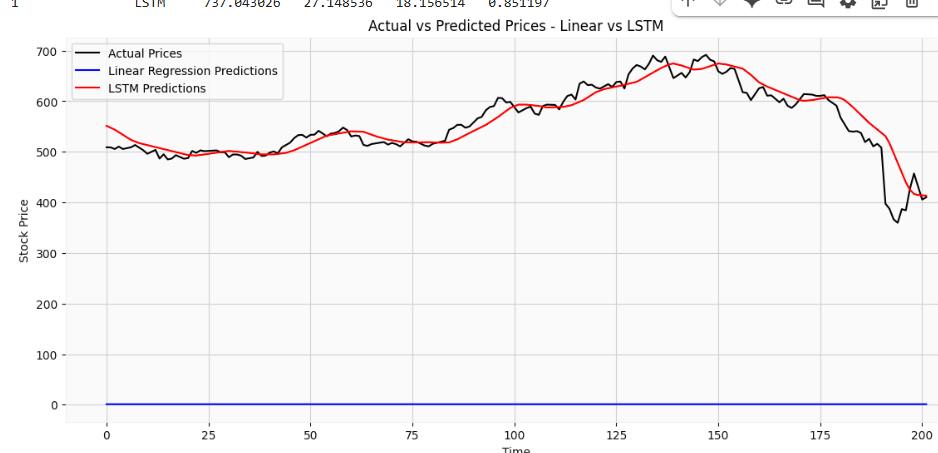

📈 Stock Price Prediction

This project focuses on predicting stock prices using historical stock market data. The goal is to analyze data patterns and apply machine learning models to forecast future prices.

📌 Features

Data preprocessing and cleaning

Exploratory Data Analysis (EDA) with visualizations

Machine Learning & Deep Learning models for prediction

Evaluation of model accuracy

🛠️ Technologies Used

Python

Pandas, NumPy – Data handling and analysis

Matplotlib, Seaborn – Data visualization

Scikit-learn – Machine Learning (Linear Regression)

TensorFlow / Keras – Deep Learning (LSTM)

🚀 Steps in Project

Load and clean the dataset

Perform Exploratory Data Analysis (EDA)

Apply models:

Linear Regression

LSTM (Long Short-Term Memory)

Evaluate models using accuracy metrics

Visualize predictions vs actual values

📂 Project Structure
📁 Stock Price Prediction
│── 📄 requirements.txt       # Required libraries
│── 📄 README.md              # Project documentation
│── 📁 dataset/               # Stock dataset (CSV file)
│── 📁 screenshots/           # Visualizations and model results

📊 Results

The project compares Linear Regression and LSTM models.

Accuracy and visualization results are shown in the screenshots folder.

🔹 Exploratory Data Analysis (EDA)

🔹 Linear Regression Prediction
🔹 

🔹 LSTM Prediction
🔹 
🔹 COMPARISON

🔮 Future Improvements

Improve LSTM model with hyperparameter tuning.

Add real-time stock price prediction using APIs.

Create a user-friendly web interface.

✨ Author

Developed by Hamza 👨‍💻

